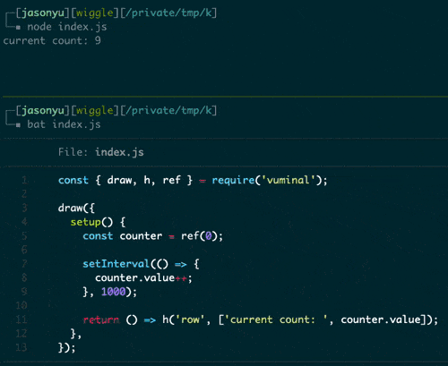

# Vuminal

Create terminal applications with the power of Vue 3.

## Usage

```ts
const { draw, h, ref } = require('vuminal');

draw({
  setup() {
    const counter = ref(0);

    setInterval(() => {
      counter.value++;
    }, 1000);

    return () => h('row', ['current count: ', counter.value]);
  },
});
```



## Author

Jason Yu
